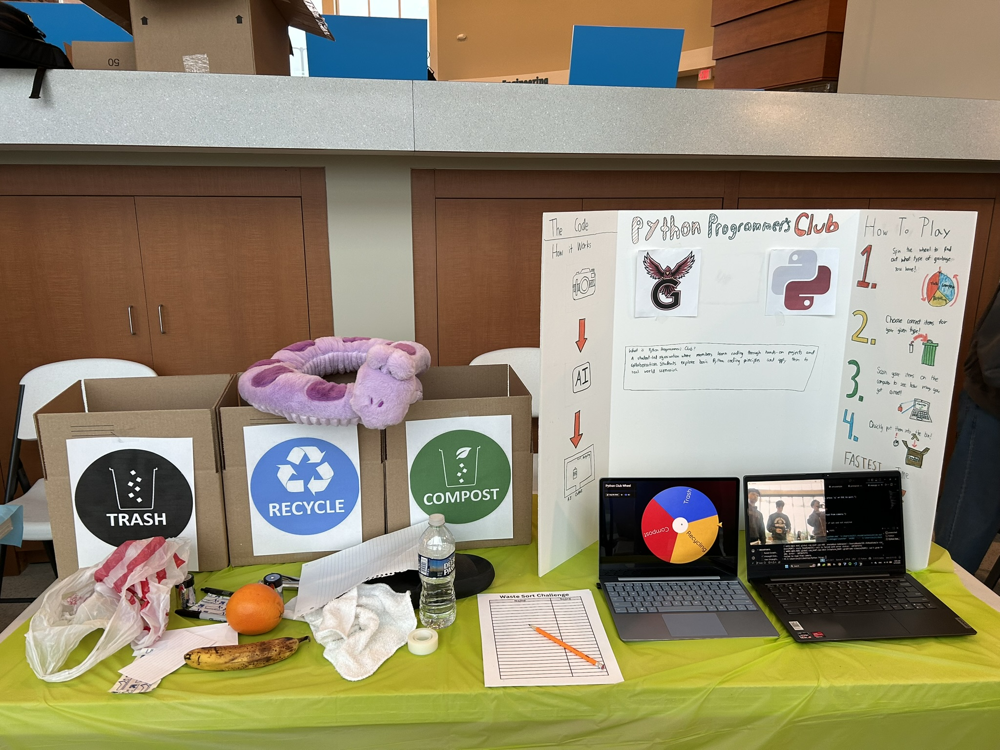
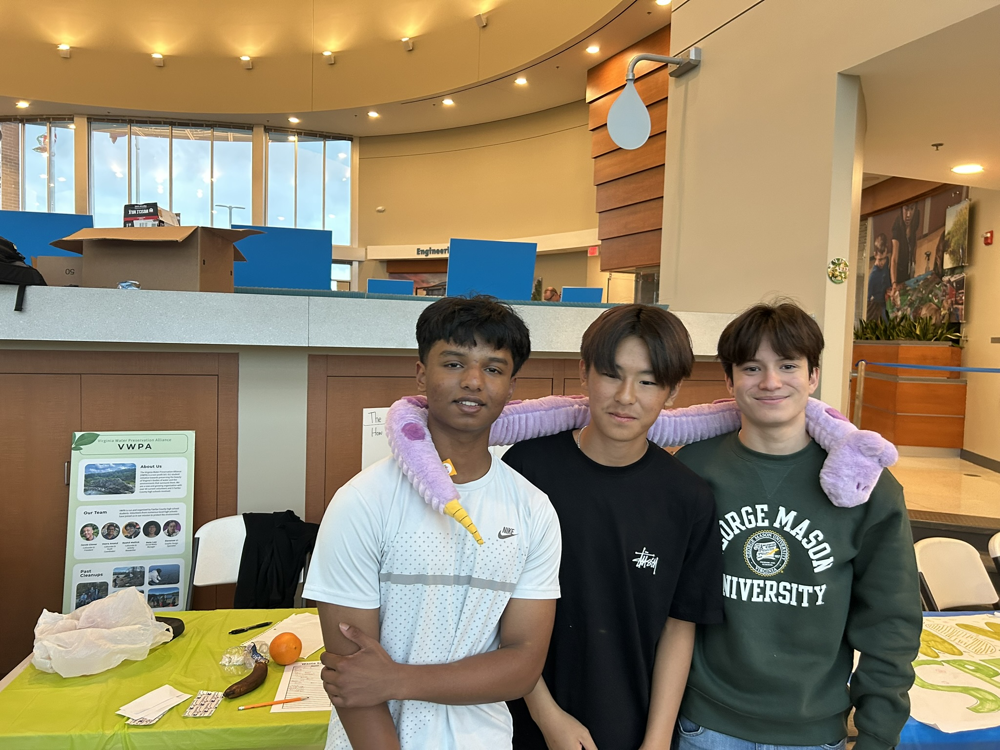

# 🌍 Earth Day AI Vision Scanner 📷🤖
**Created by the GVHS Python Programmers Club**

This project was built for the **2026 Childrens Science Center Lab Earthday Extravaganza at Loudoun Water** It is an interactive booth game where kids can use a script utilizing an AI model to instantly tell them if the item is **Trash, Recycling, or Compost**.

Powered by Python, OpenCV, and Google's Gemini models.

## 📸 Gallery
| The Booth Setup | Our Team |
| :---: | :---: |
|  |  |

Check out our [event highlights on Instagram](https://www.instagram.com/p/DXVFsIklTgT/) to see the scanner in action during the Earth Day Extravaganza!

## 💡 How the Booth Works
This activity is a fast-paced, timed sorting game! Here is how a round is played:

1. **Start the Clock:** A volunteer starts a stopwatch, and the child is given a random assortment of physical items.
2. **Scan with AI:** The child holds an item up to the webcam and the **SPACEBAR** is pressed. 
3. **Sort It:** The AI analyzes the item and displays which bin it belongs in (*Recycling, Compost, or Trash*). The child then tosses the item into the correct physical bin.
4. **Stop the Clock:** The child repeats this for every item. Once the final item is sorted, the volunteer stops the timer.
5. **Leaderboard:** The child's name and final time are recorded on our paper leaderboard so they can see how they rank against other kids at the extravaganza!

## ⚙️ Setup Instructions

**1. Clone the project and open the terminal**
```bash
git clone https://github.com/yourusername/your-repo-name.git
cd your-repo-name
```
**2. Activate the Virtual Environment**
Ensure you are using the virtual environment so the app has all its dependencies.
```bash
# Windows
.\venv\Scripts\activate

# Mac/Linux
source venv/bin/activate
```

**3. Set up the API Key**
Rename the `.env.example` file to `.env`. Add a Google API key to it:
```env
GEMINI_API_KEY="your_api_key_here"
```

## 🎮 Controls
* **SPACEBAR:** Capture an image and analyze it.
* **Q or ESC:** Close the camera application.

## 📝 The AI Prompt
The brain of this program is controlled by `prompt.txt`. For the Earth Day theme, our prompt looks something like:
> *"Look at the main object in this image. Is it Trash, Recycle, or Compost? Reply with ONLY ONE WORD: Trash, Recycle, or Compost. Do not include any punctuation."*
